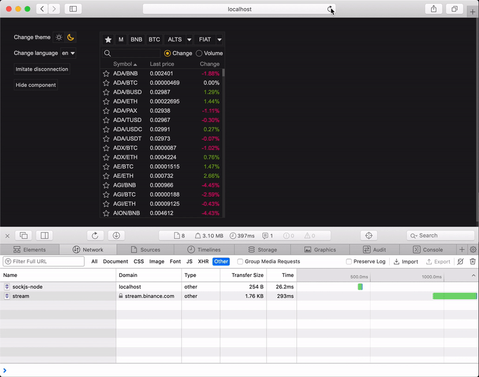

## Binance test task
Original description [here](https://github.com/orangeflame/binance-fe-test)

In the bounds of task were implemented MarketWatch widget with the next features:
1. Filtering by favorites, market group, market group category
2. Sorting by name, price, volume, change
3. Switching between columns
4. Search by name
5. Adding and removing product to favorites
6. Saving and loading user settings
7. Logic subscription/unsubscription from websocket channels
8. Language and theme switching

### To check task run the next command
```
npm install
npm start
```

### Demo

